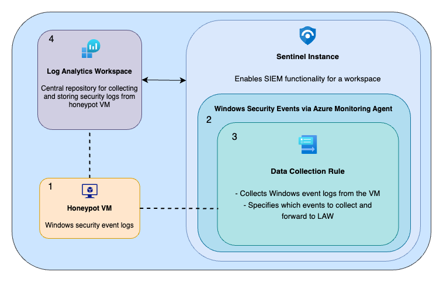
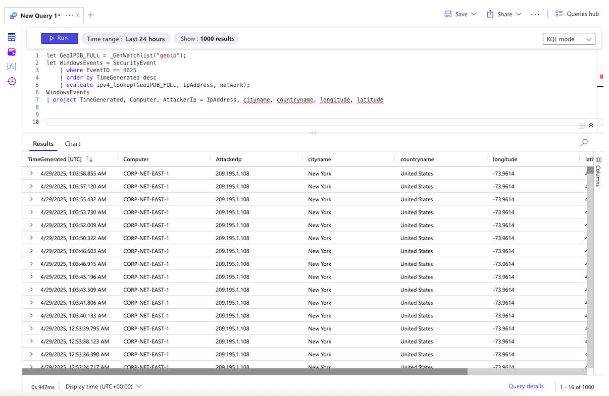
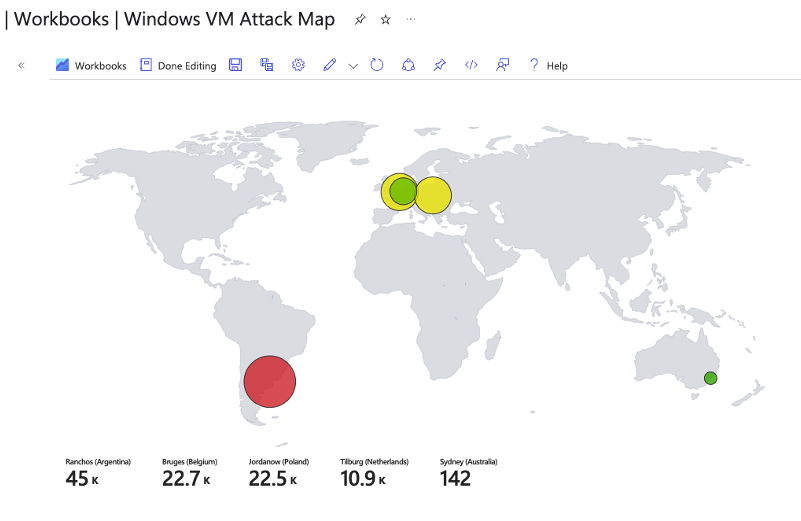
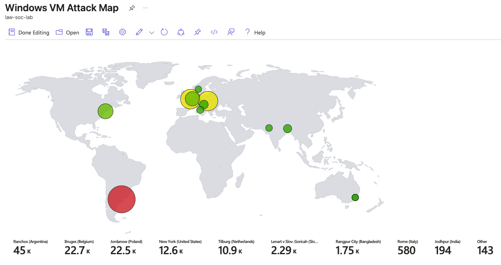

# Azure Honeypot RDP Lab
This project simulates a real-world cybersecurity environment by deploying a cloud-based honeypot in Microsoft Azure. The purpose of this lab was to gain hands-on experience in detecting, analyzing, and visualizing attack patterns against exposed cloud resources using enterprise-grade SIEM tools.

I configured an intentionally vulnerable virtual machine (VM) exposed to the public internet, centralized security event logging with Azure Log Analytics, and integrated Microsoft Sentinel for threat detection and monitoring. Using Kusto Query Language (KQL) and geolocation enrichment, I analyzed failed Remote Desktop Protocol (RDP) login attempts and visualized attacker origins across the globe.

    

# Objectives
<ul>
  <li>Deploy a public-facing VM in Azure to simulate a honeypot</li>
  <li>Configure Log Analytics Workspace (LAW) to centralize security event collection</li>
  <li>Forward security logs from the VM and integrate them with Sentinel for real-time monitoring</li>
  <li>Query failed login attempts using KQL and enrich the data with geolocation information</li>
  <li>Create an attack map to track real-time hacker activity across the globe</li>
</ul>

 

# Process

<h3>1. Set up VM</h3>
<ul>
<li>Created an image of Windows 10 Pro</li>
<li>Network Security Group in Azure modified to allow all inbound traffic</li>
<li>Connected remotely to VM to disable the firewall state for Domain, Private, and Public Profiles</li>
  <blockquote><em>This configuration is intended for lab use only. Exposing a VM with all inbound traffic and no firewall is highly insecure and should never be done in a production environment.</em></blockquote>
<li>Pinged VM from local computer to make sure it's reachable over the internet</li>
</ul>

---

<h3>2. Log Collection Configuration</h3>

  
     <blockquote>RDP failed login attempts are captured in the Windows Event Viewer. These events are forwarded to Azure Log Analytics Workspace, where they can be queried and analyzed in Microsoft Sentinel, to identify the origin of attempted attacks against the honeypot VM.</em></blockquote>

 

<ul>
  <li><strong>Created a Log Analytics Workspace (LAW)</strong> to serve as a central log repository for forwarding VM security events.</li>
  <li><strong>Deployed a Sentinel instance and connected it to Log Analytics Workspace (LAW)</strong> to enable centralized access to security logs through the SIEM platform.</li>
  <li>
    <strong>Installed and configured Windows Security Events</strong>:
    <ul>
      <li>
          Connected the VM to workspace using the <b>Azure Monitoring Agent (AMA)</b> connector.
      </li>
<ul>
      <li>
        Created a <b>Data Collection Rule (DCR)</b>, to automatically forward security event logs from the VM into workspace, enabling Sentinel to ingest and query the data in real time. 
      </li>
</ul>
    </ul>
  </li>
 

<em>What is Azure Monitor Agent (AMA)?</em>
 

It collects logs and performance data from VMs running in Azure, on-premises, or in other cloud environments. It sends data to **Azure Monitor**, where services like **Microsoft Sentinel** and **Microsoft Defender for Cloud** can use it for analysis.

AMA collects all data by using **Data Collection Rules (DCRs)**, which define:
 
    - What data is collected 
    - How the data is filtered, transformed, or aggregated 
    - Where the data is sent (e.g., Log Analytics Workspace)

</ul>

  

---

<h3>3. Querying logs in LAW</h3>

<ul>
    <li>Uploaded the <code>geoip-summarized.csv</code> file as a Sentinel watchlist to provide geolocation data for public IP address blocks. This enrichment allowed mapping attacker IPs to physical locations (city, country, lat/long).
      
      <blockquote><em><code>geoip-summarized.csv</code> is a geolocation dataset containing IP ranges and location data to enrich attacker IPs with geographic context. In production environments, this process is typically automated through live threat intelligence feeds or maintained internally by a security team.</em></blockquote>
</li>
     
  <li>Queried failed login attempts <code>Event ID == 4625</code> using Kusto Query Language (KQL)</li>
     
    <pre><code>
let GeoIPDB_FULL = _GetWatchlist("geoip");
let WindowsEvents = SecurityEvent;
WindowsEvents
    | where EventID == 4625
    | order by TimeGenerated desc
    | evaluate ipv4_lookup(GeoIPDB_FULL, IpAddress, network)
WindowsEvents
    | project TimeGenerated, Computer, AttackerIp = IpAddress, cityname, countryname, longitude, latitude
</code></pre>
</ul>

 

  

<blockquote>
    Query output showing failed RDP login attempts with enriched location data from the IP geolocation watchlist.
</blockquote>

<blockquote>
The geolocation watchlist allowed the KQL query to perform an IP range lookup via the <code>ipv4_lookup()</code> function, correlating attacker IPs with real-world locations.
</blockquote>

---
<h2>4. Attack Map Creation </h2>

<ul>
    <li>Imported <code>map.json</code> file into a new Sentinel Workbook using the Advanced Editor to generate a global heatmap.</li>
    <blockquote>
    <em>The <code>map.json</code> file includes a built-in KQL query that runs when you add it to a Sentinel Workbook. The query pulls failed login events, enriches them with geolocation data from the watchlist, and sends the results to the map. It also controls how the map looks with attributes like bubble size, colors, and labels showing city and country names.</em>
    </blockquote>
</ul>
 

<ul>
    <li>The map visualizes attacker IPs by correlating enriched geolocation data (latitude/longitude) with failed login counts, highlighting regions with high attack activity.</li>
</ul>
    
---

<h3>Attack Map Activity Over Time</h3>

To monitor how external attacks build up over time, I kept the honeypot VM exposed to the internet for several hours.

The Sentinel Workbook attack map continuously updated as failed RDP login attempts were recorded and matched with geographic data from the watchlist.

<h4 align="center"> Initial Results (0–1 hour)</h4>

  

    <blockquote>
        Shortly after deploying the honeypot, a few failed RDP login attempts were detected, mostly from a limited number of regions. This confirms that exposed systems are quickly found by automated scanners.
    </blockquote>

<h4 align="center"> Updated Results (10 hours)</h4>

  

    <blockquote>
        After leaving the honeypot exposed for about 10 hours, the number and spread of failed RDP login attempts increased significantly — showing attacks from multiple countries and networks.
    </blockquote>

 

# Takeaways

<ul>
  <li><strong>Exposed services are high-risk assets</strong> 
    Public-facing RDP is a well-known attack vector. Even during a short exposure window, the VM was targeted by automated scanning tools. This highlights the importance of hardening access using NSG rules, account lockout policies, host-based firewalls, and secure access solutions like Azure Bastion.
  </li>
   
  <li><strong>Log telemetry is foundational to detection</strong> 
    Without forwarding security logs to a centralized workspace, detection and investigation would not be possible. Without this step, a security analyst/team has no line of sight into endpoint activity or brute-force behavior.
  </li>
   
  <li><strong>Data context accelerates triage</strong> 
    Matching attacker IPs with geographic location made it easier to understand threat patterns and prioritize analysis. In a live SOC, this kind of enrichment helps filter noise, spot patterns, and respond with appropriate urgency.
  </li>
   
  <li><strong>Visual dashboards support situational awareness</strong> 
    The attack map served as a real-time view into where attacks were originating. In enterprise settings, similar dashboards help analysts spot anomalies and detect coordinated attacks faster.
  </li>
   
  <li><strong>KQL enables efficient investigation</strong> 
    Writing KQL queries to identify failed RDP logins and correlate them with geolocation data mirrors how detection and response teams perform root-cause analysis and monitor threat activity in Microsoft-based environments.
  </li>
</ul>

 

This project provided a realistic view of how exposed cloud resources are targeted and monitored in a SOC environment. It emphasized the importance of log visibility, contextual analysis, and actionable insights using SIEM tools like Microsoft Sentinel.

