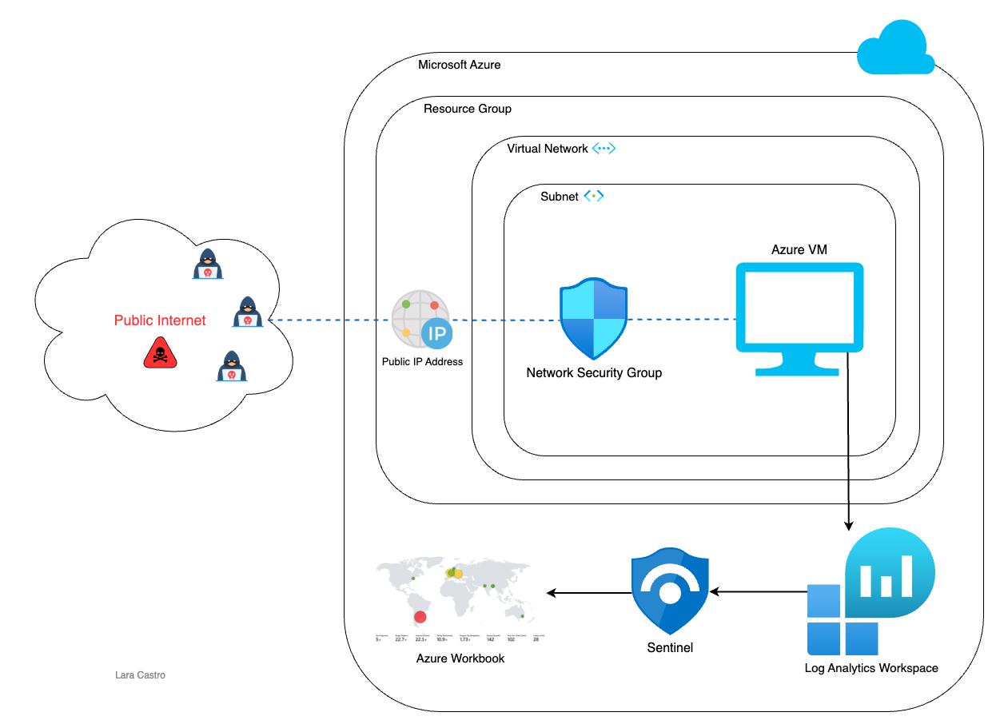
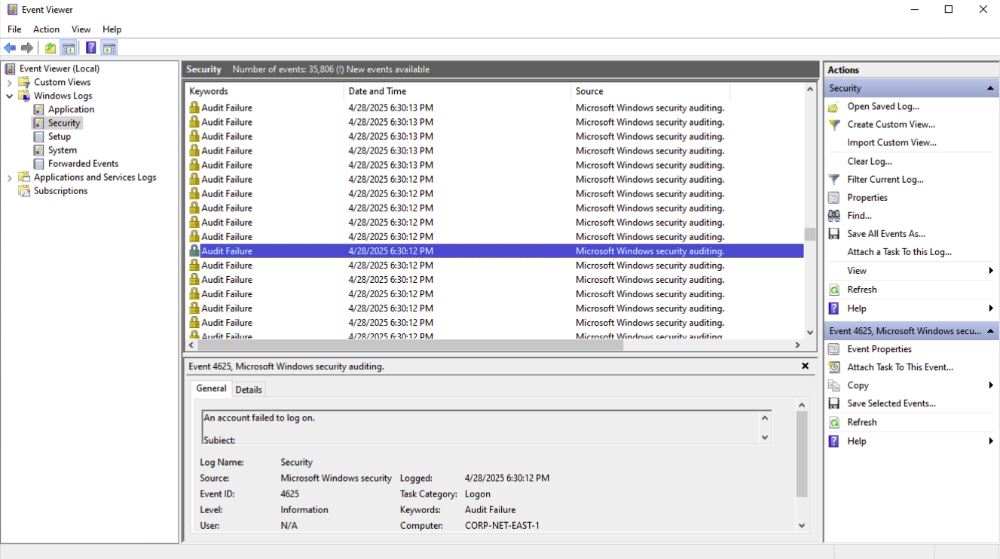

# Azure Honeypot RDP Lab
This project simulates a real-world cybersecurity environment by deploying a cloud-based honeypot in Microsoft Azure. The purpose of this lab was to gain hands-on experience in detecting, analyzing, and visualizing attack patterns against exposed cloud resources using enterprise-grade SIEM tools.

I configured an intentionally vulnerable virtual machine (VM) exposed to the public internet, centralized security event logging with Azure Log Analytics, and integrated Microsoft Sentinel for threat detection and monitoring. Using Kusto Query Language (KQL) and geolocation enrichment, I analyzed failed Remote Desktop Protocol (RDP) login attempts and visualized attacker origins across the globe.

    

# Objectives
<ul>
  <li>Deploy a public-facing VM in Azure to simulate a honeypot</li>
  <li>Configure Log Analytics Workspace (LAW) to centralize security event collection</li>
  <li>Forward security logs from the VM and integrate them with Sentinel for real-time monitoring</li>
  <li>Query failed login attempts using KQL and enrich the data with geolocation information</li>
  <li>Create an attack map to track real-time hacker activity across the globe</li>
</ul>

# Key Steps

1. Deploy VM
<ul>
<li>Created an image of Windows 10 Pro</li>
<li>Network Security Group in Azure modified to allow all inbound traffic</li>
<li>Connected remotely to VM to disable the firewall state for Domain, Private, and Public Profiles</li>
   
      ⚠️ <em>This configuration is intended for lab use only. Exposing a VM with all inbound traffic and no firewall is highly insecure and should never be done in a production environment.</em>
</ul>

 

---

2. Log Collection Configuration

  

<em>RDP failed login attempts are captured in the Windows Event Viewer. These events are forwarded to Azure Log Analytics Workspace, where they can be queried and analyzed in Microsoft Sentinel to identify the origin of attempted attacks against the honeypot VM.</em>

<ul>
  <li>Created a central log repository (Log Analytics Workspace) to forward the VM logs there.</li>
  <li>Deployed a Sentinel instance and connected it to LAW, enabling centralized security event monitoring through Sentinel.</li>
  <li>Installed <em>Windows Security Events</em> within the Sentinel instance.
    <ul>
      <li>Configured the <em>Windows Security Events via Azure Monitoring Agent (AMA)</em> connector to link the VM to LAW.</li>
      <ul>
        <li>This setup uses a <em>Data Collection Rule (DCR)</em> to automatically forward security event logs from the VM into LAW, enabling Sentinel to ingest and query the data in real time.</li>
      </ul>
    </ul>
  </li>
</ul>

 

---

3. 

